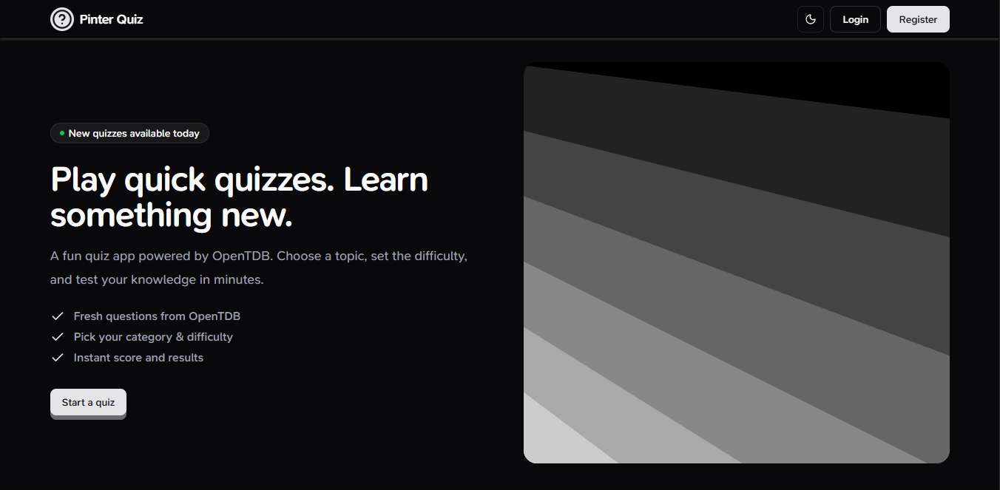
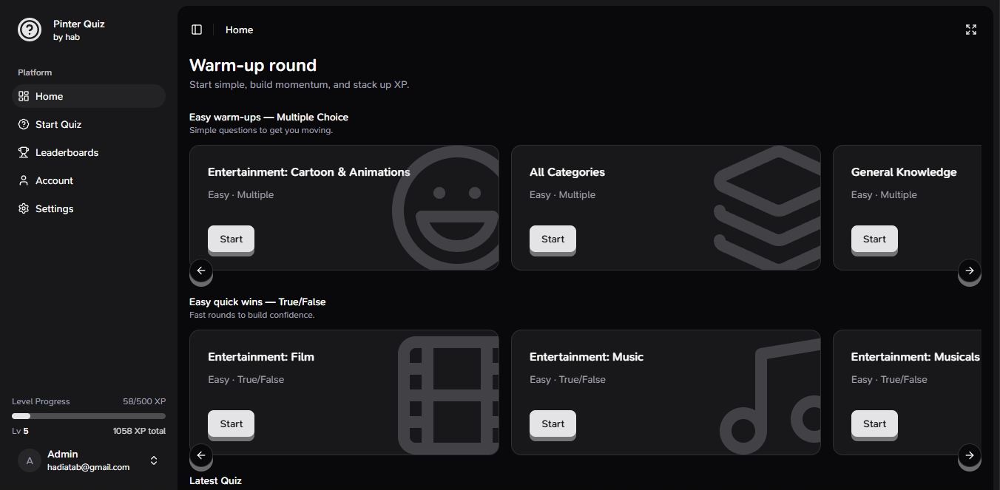
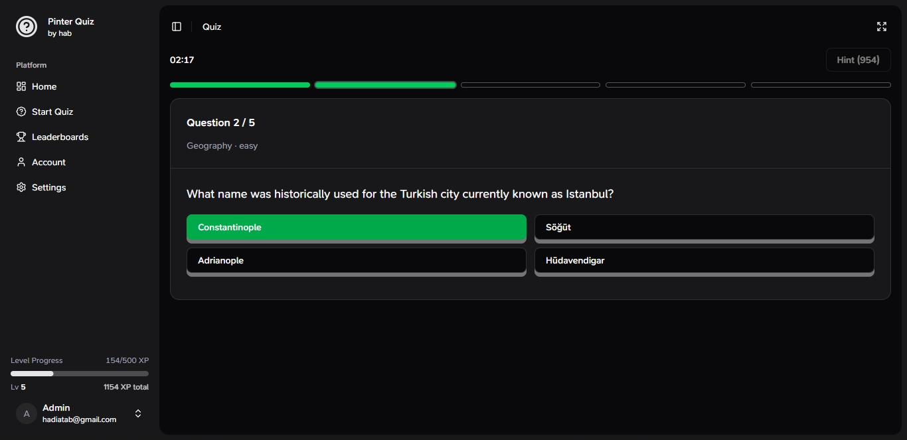

# Pinter Quiz App (Powered by OpenTDB)

[](https://hdiatab.github.io/pinter-quiz/#/)

This is a **quiz website app** where people can:

- create an account,
- play quizzes (questions come from **OpenTDB**),
- get a score + rewards,
- level up,
- see leaderboards,
- customize settings (theme, quiz mode, etc.).

This guide explains the app in a **very simple** way (non-technical), and shows how to install it using **Bun**.

---

## What is this app?

Think of it like a **trivia game website**.

You log in → choose a quiz → answer questions → get results → earn XP → level up → compare with others on the leaderboard.

The questions are fetched from **OpenTDB**, so you don’t need to write your own questions manually.

---

## Main Parts of the App

### 1) Landing Page (Public)

- This is the page people see first.
- Usually has marketing content like “Start a quiz” and app information.
- No login needed.

---

### 2) Login & Register

The app has 2 pages:

- **Register**: create a new account
- **Login**: sign in to your account

After you log in, you can access the “inside app” pages (dashboard).

---

### 3) Dashboard Pages (After Login)

Once you are logged in, you can open these pages:

#### ✅ Home

- Shows quiz options in a nice carousel.
- It suggests quiz difficulty based on your level.
- Also shows **Latest Quiz** (so you can quickly replay your last quiz).

#### ✅ Start Quiz

This is where you can fully customize a quiz:

- pick category (or any category),
- choose difficulty,
- choose question type (Multiple Choice / True-False),
- choose how many questions,
- choose time limit.

Some options are locked depending on your level (so the game feels progressive).

#### ✅ Quiz Page

This is where you actually play:

- There is a timer.
- You answer questions one by one.
- It shows small “progress indicators”:
  - correct = green
  - wrong = red
  - unanswered = plain
  - current question = highlighted

#### ✅ Quiz Result Page

After the quiz ends, you see:

- how many you answered
- how many correct / wrong
- accuracy percentage
- star rating
- rewards:
  - **XP**
  - **tokens**
  - maybe **level up**

If you level up, it shows **confetti** 🎉.

#### ✅ Leaderboards

- Shows the ranking of users.
- Ranking is based on XP.
- You can click a user to see their public profile.

#### ✅ Account (Your Profile)

You can edit:

- display name
- bio
- profile photo (avatar)
- cover image
- change password

It also shows your game stats:

- quizzes played
- correct / wrong totals
- accuracy
- last played time

#### ✅ Public User Profile

- This is a read-only profile page for other users.
- You can view it via `/account/:id`
- Shows their stats and bio.

#### ✅ Settings

You can change:

- **Quiz mode**
  - Auto mode
  - Manual mode
- Auto-next delay (if Auto mode)
- Theme (Light / Dark / System)
- Layout options (sidebar style etc.)

---

## How the Quiz Works (Super Simple)

### Quiz Types

You can play:

- **Multiple Choice** (4 options)
- **True / False** (2 options)

### Quiz Difficulties

- Easy
- Medium
- Hard
- Mixed (random difficulty)

### Difficulty Unlock (based on level)

The app shows harder difficulties after you level up:

- Low level = easy only
- Medium level = medium + easy
- High level = hard + medium + easy

---

## Quiz Modes: Auto vs Manual

### Auto Mode

- Tap an answer → it instantly reveals correct/wrong → after a short delay it goes to next question automatically.

### Manual Mode

- Tap an answer → you must press **Submit**
- After submit, you press **Continue** to go next

You can change this in **Settings**.

---

## Hint System (Tokens)

During a quiz, there is a **Hint** button.

What it does:

- It removes (disables) **one wrong answer** for you.

Cost:

- It uses **1 token**.

If you have no tokens, hint won’t work.

---

## Rewards (XP, Level, Tokens)

After finishing a quiz:

- You gain **XP** based on performance (and difficulty).
- You may gain **tokens**:
  - bonus tokens for perfect runs
  - bonus tokens when you level up

If you level up, you see a big celebration effect 🎉.

---

## Data Storage (Important Note)

This app saves user data in the browser:

- user list
- who is logged in
- profile info
- last quiz info
- stats like XP, level, tokens

So basically:

- it works nicely for demo / local project
- but it’s not a real backend database (yet)

---

# Installation (Recommended with Bun)

## Requirements

- Install **Bun**
- Node is not required if you use Bun (Bun includes runtime + package manager)

### 1) Install dependencies

Inside your project folder, run:

```bash
  bun install
```

### 2) Run development server

```bash
  bun run dev
```

Then open the URL shown in your terminal (usually something like http://localhost:5173).

### 3) Build for production

```bash
  bun run build
```

### 4) Preview the production build

```bash
  bun run preview
```

### Common Commands (Quick List)

```bash
  bun install
  bun run dev
  bun run build
  bun run preview
```

## Final Summary (What users can do)

Users can:

- Register & Login
- Choose quiz category, difficulty, and type
- Play quiz with timer
- Use hints with tokens
- See results + rewards
- Level up and progress
- Check leaderboards
- Edit their profile
- Customize settings (theme & quiz behavior)

## License

MIT

## Screenshots

### Landing Page



### Home Page



### Quiz Page


